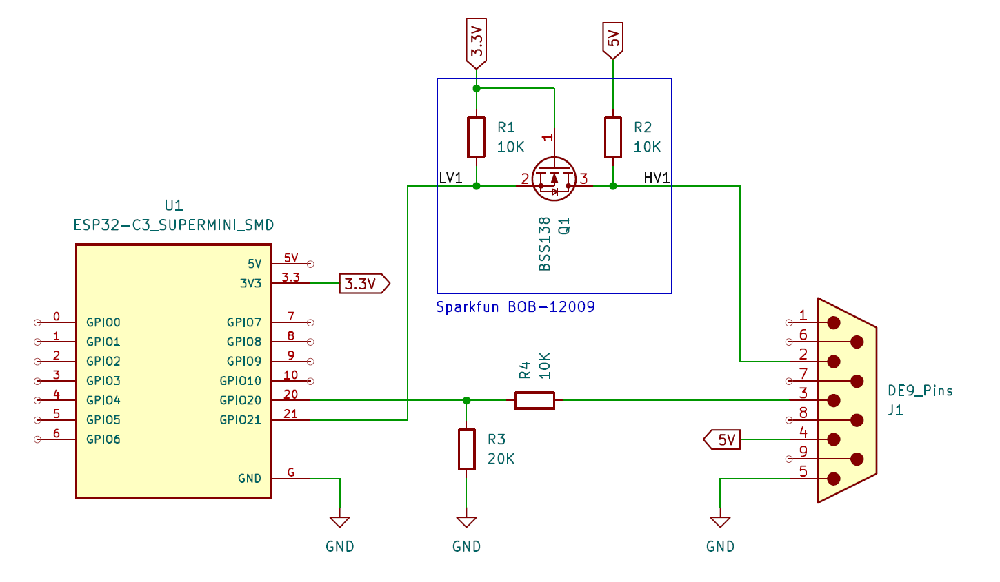

# esphome-rego600
Started as a fork of https://github.com/dala318/esphome-rego600 but that had issues with blocking UART calls causing WDT reset during setup when adding all registers. **This fork is a major rewrite with a non-blocking state machine.**

Huge shout-out to ["How to connect heat pump with Rego 6xx controller"](https://rago600.sourceforge.net/) who I guess did most of the reverse engineering of the protocol used by most Rego600 interfaces out there.

To be used as external component to ESPHome. To my knowledge this is now a working component that does what it is supposed to do.

> **NOTE**: I'm a mechancial design engineer, not an electronics engineer nor a software engineer. Expect the quality to be accordingly :)

## Harware
The component is not bound the any specific harware setup, it only requires that a UART port of the MCU is connectred to the external comms-port of the heat-pump.

I used a ESP-C3 developmet board with external antenna. The ESP is mounted on the DB-9 connector and the antenna is mounted outside the heat pump enclosure. For UART interface I use logic level converter for the Rego RX signal and a simple voltage divider for the Rego TX signal. The logic level converter did not work for the Rego TX signal. The Rego TX signal is inverted.

> **WARNING**: I don't know if the Rego UART is isolated so I can't recommend this setup, I only describe what I have done.

> **INFO**: Don't get tempted running long cables for the serial bus. The checksum is calculated on the data part of the package only so transmission errors on the command will not be caught. Data for read is "0", so Rego will sometime think your sending a write command and write "0" to that register. Believe me, I've tried.

## Configuration in ESPHome

See [rego600.yaml](rego600.yaml) for an example ESPHome configuration. I've included all registers known to me and some ideas on automation etc.

> **NOTE**: The label in my heat pump says "Rego637E". However the registers labeled "Rego600-635" at (https://rago600.sourceforge.net/) is what works for me, what is in the [rego600.yaml](rego600.yaml)

## Licensing
This work is licensed under the CC-BY 4.0 International License. To view a copy of this license, visit: https://creativecommons.org/licenses/by/4.0/

Part of the code dealing with composing and decomposing the UART commands is most likely originating from the Arduino sketch provided by [how to connect heat pump with Rego 6xx controller](https://rago600.sourceforge.net/) licensed "postcardware", see the link.