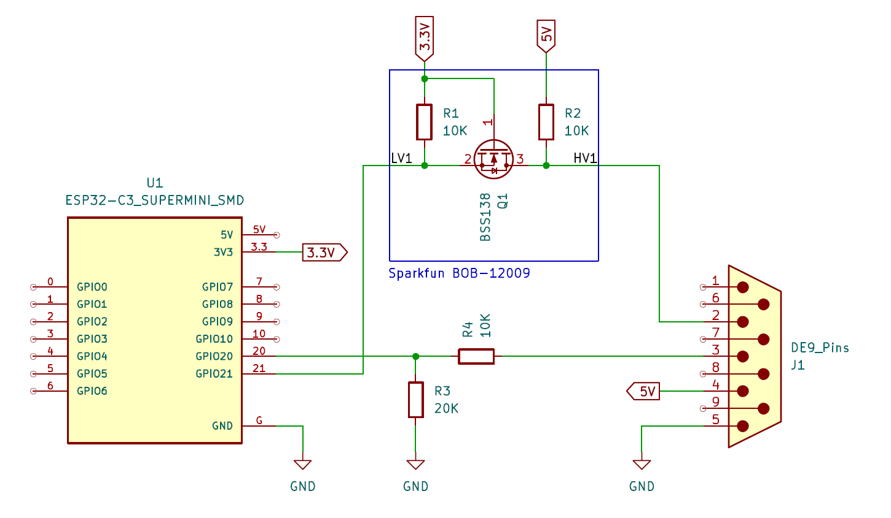
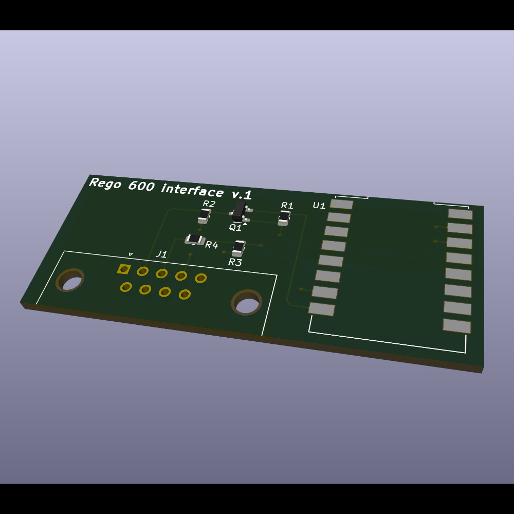
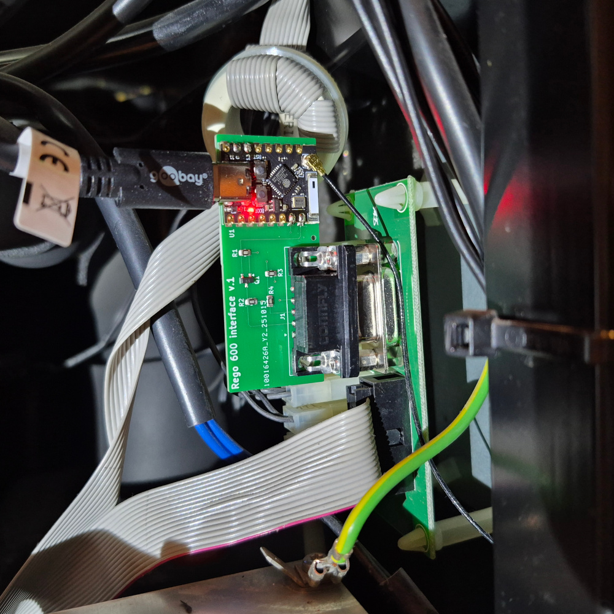
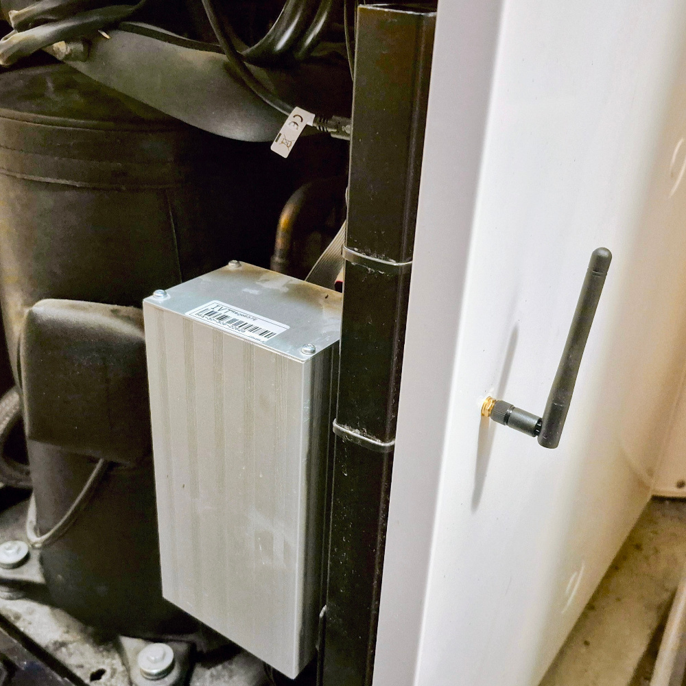

# esphome-rego600

External component for ESPHome enabling communication with Rego 6xx heat pump controllers.

&#x2615; [Buy me a coffee :)](https://paypal.me/davidalind)

## Overview
This project started as a fork of https://github.com/dala318/esphome-rego600 but that version had issues with blocking UART calls, causing WDT resets during setup when adding all registers. **This fork is a major rewrite using a non-blocking state machine.**

Huge shout-out to ["How to connect heat pump with Rego 6xx controller"](https://rago600.sourceforge.net/) who I guess did most of the reverse-engineering of the protocol used by most Rego600 interfaces out there.

To my knowledge, this is now a working component that performs as intended.

> **NOTE**: I'm a mechanical design engineer, not an electronics or software engineer—so expect the quality to reflect that. :)

## Hardware
The component is not bound to any specific hardware setup; it only requires that a UART port of the MCU be connected to the external communication port of the heat pump.

I used an ESP-C3 Super Mini development board with an external antenna ([this one](https://www.aliexpress.com/item/1005008047249439.html)). The ESP is mounted on the DB-9 connector, and the antenna is mounted outside the heat pump enclosure. For the UART interface, I use a logic-level converter for the Rego RX signal and a simple voltage divider for the Rego TX signal. Note that the Rego TX signal is inverted.

You can find manufacturing files adopted for ["JLC PCB"](https://jlcpcb.com/) (jlcpcb-*), and a KiCad 9.0 project, in the  [`/hardware`](/hardware) folder. The connector and ESP32 Super Mini board are marked as DNP (Do Not Populate).

> **WARNING**: I don’t know whether the Rego UART is isolated, so I can’t recommend this setup — I’m only describing what I have done.

> **INFO**: Do not use long cables for the serial bus. The checksum is calculated only for the data portion of the packet, so transmission errors in the command section won’t be detected. Data for read is "0". If a read command is corrupted, the Rego may interpret it as a write command and write 0 to that register. (I’ve got the T-shirt.)

## Configuration in ESPHome

See [rego600.yaml](rego600.yaml) for an example ESPHome configuration. It includes all registers known to me and some ideas for automation.

> **NOTE**: The label in my heat pump says *Rego637E*. However, the registers listed as "Rego600-635" on (https://rago600.sourceforge.net/) are what work for me. Those are also used in [rego600.yaml](rego600.yaml)

## Licensing
This work is licensed under the **CC-BY 4.0 International License**. To view a copy of this license, visit: https://creativecommons.org/licenses/by/4.0/

Parts of the code dealing with composing and decomposing UART commands most likely originate from the Arduino sketch provided by [how to connect heat pump with Rego 6xx controller](https://rago600.sourceforge.net/), which is licensed as *postcardware* (see link for details).